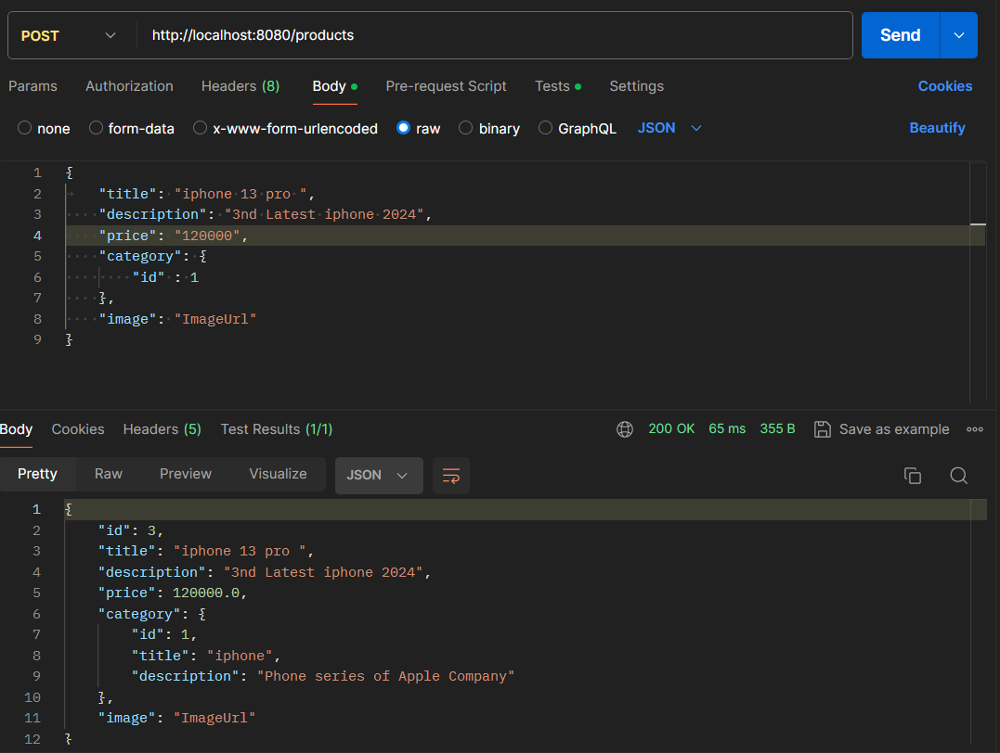

# Step-1 : Finished Product API

- Get all products
- Get a single product

#### http://localhost:8080/products/7

#### http://localhost:8080/products

# Step-2 : Exception Handling
Exception Handling is important because, 
- if we don't handle the exception then a LOT of INTERNAL DATA will be exposed to the client. This creates a serious Security Threat. 
- Moreover, it is not User-Friendly.

#### Topics Covered : 
- Runtime Exception through Controller Layer
- Runtime Exception through Service Layer
- Try Catch
- Response Entity
- Exception DTO
- Controller Advices [ Specific Exception && General Exception ]
- Custom Exceptions

#### Response Entity

We generally get multiple responses/Data from an API. If you want to return more data, we have a class called Response Entity.
  
Response Entity will have lot of things. 
- Response Body ( the object that you want to pass)
- Status Code (200, 404, 400)
- Headers

#### Status Codes
- HttpStatus.OK : 200
- HttpStatus.NOT_FOUND : 404
- HttpStatus.BAD_REQUEST : 400

#### Exception Handling through Controller using Response Entity

#### Response Entity Through Exception DTO

- While handling the Exception inside the controller we are writting a lot of code inside the controller. 
- This makes the controller Bulky.
- Controller should be as Light as Possible.
- There shouldn't be any Business Logic Inside the controller.
- Hence, here comes the Logic of Controller Advices.

#### Controller Advice  ( Censor Board )
- Special class by Spring FrameWork (Annotation)
- When the response is being returned by the Controller, before reaching to the client there is a final check called Controller Advice.
- Every response will be pass via Controller Advice.
- It is the final thing through which the Exception will pass before reaching to client.
- Additional check on whatever is being pass by controller to the client.
- In the controller Advice, we can modify the content that is being passed by the controller just before reaching to the client.

#### Exception Handling using Controller Advice

#### Custom Exception

# Step - 3 : DataBase

#### Topics Covered :
- JPA 
- ORM 
- JPA Interface
- Hibernate
- JDBC Interface : Java DataBase Connectivity
- Cardinality

#### JPA : Java Persistance Api
- Creates tables
- All CRUD operations

#### ORM : Object Relational Mapping 
- Provides us an easy way to work with Database based on models that are present in your codebase.
- Can automatically create table for models
- CRUD

##### Add Dependencies and Configure application.properties

- MVN Repository . com
- Search Spring starter JPA
- copy and add in the pom.xml
- Remove the version [ as it is a spring library, spring will automatically detect the version]
- Also add mysql connector dependency 
- Don't remove version. [ because this is not a spring lib. Hence spring can't able to detect it version if not provided ]
- From the spring Official documentation add the required configurations to the application.properties
- Create a new Database and user in the Mysql Workbench
- Update the database name and username in the application.properties
- Connect the database to Intellij

#### Cardinality
- Relation between two Tables

#### Add Annotations and Cardinality
- Every Model should have a Database.
- Add Entity annotation to tell spring to create database.
- Also add "Id" annotation
- Put appropiate Cardinality annotation to show Links between databases.

#### Databases are created.

# Step - 4 : Repository Pattern

#### Topics Covered
- PostMapping @RequestBody
- Upsert Operation
- save() method for upsert operation
- Primary Annotation && Qualifier Annotation
- @GeneratedValue(strategy = GenerationType.IDENTITY)
#### Repository Pattern

- Code to interact with persistance(DB) layer should be separated from service layer.

JpaRepository Interface expects two parameters : 
1. Model
2. DataType of the primary Key Attribute

- In Database Primarykey is the unique name/Identifier (kind of aadhar card of the product)
- Open-Closed Principle : Open for extension Closed for modification

For creating and Updating operations Spring uses the save(Product p) for both.
- If the input product object is having an id, then it is going to be an update.
- If the input product object doesn't have an Id, then it is going to be a create product.
- Update + Insert = Upsert operation

#### http://localhost:8080/products  || POST

